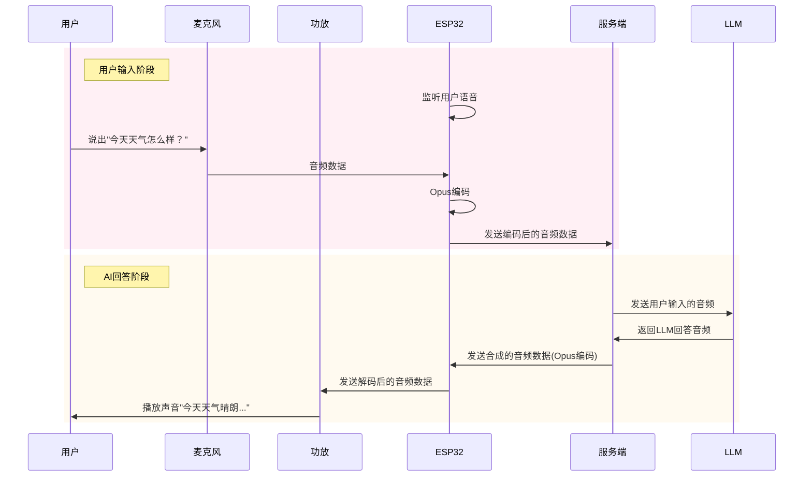
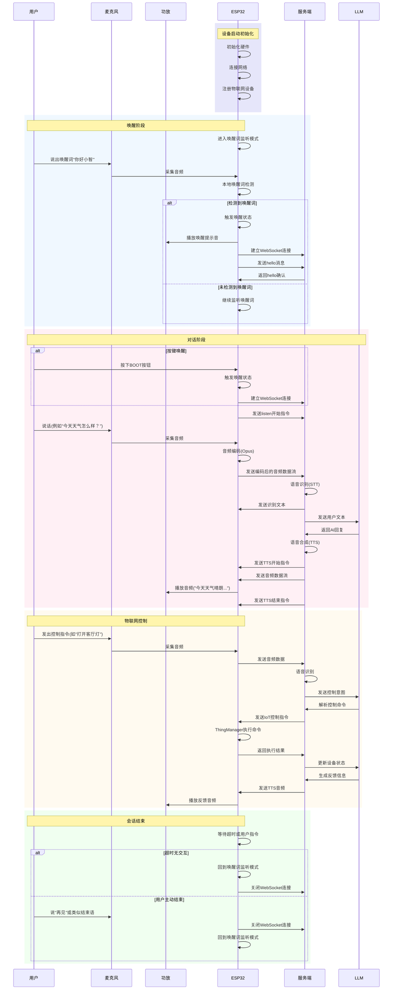

# 复刻小智

小智 AI 源码地址: https://github.com/78/xiaozhi-esp32

## AI 提示词

### 通过小智AI源码获取交互时序图

本项目是小智AI的源码，我希望你能分析代码，告诉我核心的交互逻辑
并通过使用mermaid生成交互时序图
时序图应该包含的对象如下：
用户、麦克风、功放、ESP32、服务端、LLM

## 简化版交互时序图

## 详细的小智 AI 交互时序图

