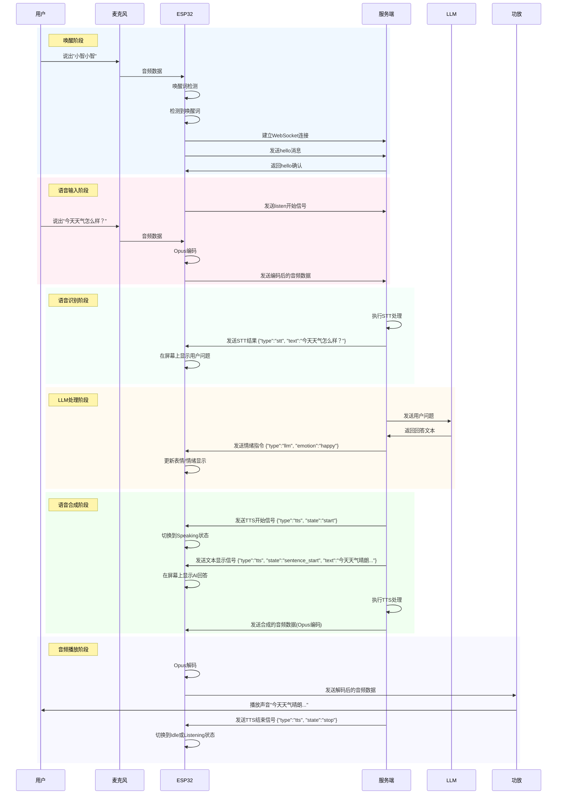

# 复刻小智AI

## 小智AI核心交互时序图

```mermaid
sequenceDiagram
    participant 用户
    participant 麦克风
    participant ESP32
    participant 服务端
    participant LLM
    participant 功放
    
    rect rgb(240, 248, 255)
    note right of 用户: 唤醒阶段
    用户->>麦克风: 说出"小智小智"
    麦克风->>ESP32: 音频数据
    ESP32->>ESP32: 唤醒词检测
    ESP32->>ESP32: 检测到唤醒词
    ESP32->>服务端: 建立WebSocket连接
    ESP32->>服务端: 发送hello消息
    服务端->>ESP32: 返回hello确认
    end
    
    rect rgb(255, 240, 245)
    note right of 用户: 语音输入阶段
    ESP32->>服务端: 发送listen开始信号
    用户->>麦克风: 说出"今天天气怎么样？"
    麦克风->>ESP32: 音频数据
    ESP32->>ESP32: Opus编码
    ESP32->>服务端: 发送编码后的音频数据
    end
    
    rect rgb(245, 255, 250)
    note right of 用户: 语音识别阶段
    服务端->>服务端: 执行STT处理
    服务端->>ESP32: 发送STT结果 {"type":"stt", "text":"今天天气怎么样？"}
    ESP32->>ESP32: 在屏幕上显示用户问题
    end
    
    rect rgb(255, 250, 240)
    note right of 用户: LLM处理阶段
    服务端->>LLM: 发送用户问题
    LLM->>服务端: 返回回答文本
    服务端->>ESP32: 发送情绪指令 {"type":"llm", "emotion":"happy"}
    ESP32->>ESP32: 更新表情/情绪显示
    end
    
    rect rgb(240, 255, 240)
    note right of 用户: 语音合成阶段
    服务端->>ESP32: 发送TTS开始信号 {"type":"tts", "state":"start"}
    ESP32->>ESP32: 切换到Speaking状态
    服务端->>ESP32: 发送文本显示信号 {"type":"tts", "state":"sentence_start", "text":"今天天气晴朗..."}
    ESP32->>ESP32: 在屏幕上显示AI回答
    服务端->>服务端: 执行TTS处理
    服务端->>ESP32: 发送合成的音频数据(Opus编码)
    end
    
    rect rgb(248, 248, 255)
    note right of 用户: 音频播放阶段
    ESP32->>ESP32: Opus解码
    ESP32->>功放: 发送解码后的音频数据
    功放->>用户: 播放声音"今天天气晴朗..."
    服务端->>ESP32: 发送TTS结束信号 {"type":"tts", "state":"stop"}
    ESP32->>ESP32: 切换到Idle或Listening状态
    end
```