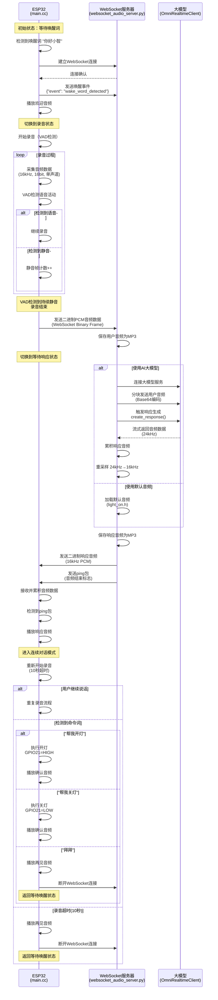
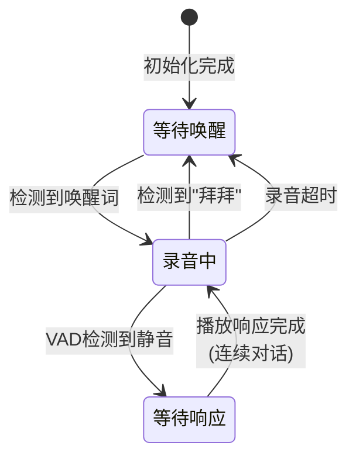
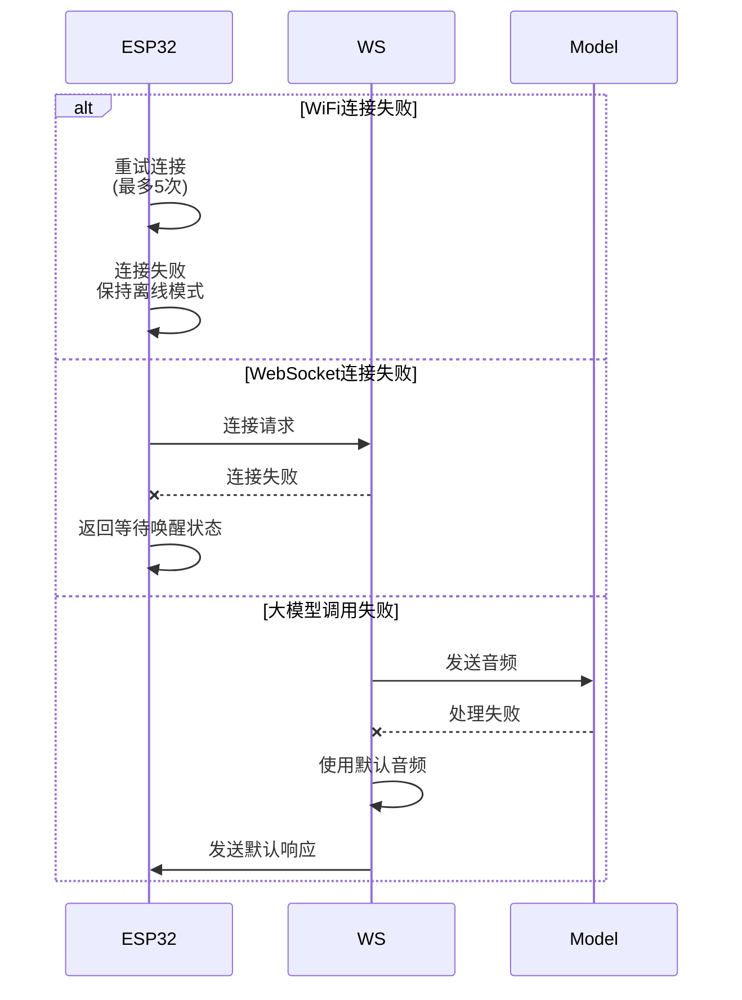

# ESP32与WebSocket服务器交互时序图

## 核心交互流程



## 关键数据流

### 1. 音频数据格式
- **ESP32发送**: 16kHz, 16bit, 单声道 PCM
- **服务器接收**: 二进制WebSocket帧
- **大模型输入**: Base64编码的音频块
- **大模型输出**: 24kHz PCM
- **服务器响应**: 重采样到16kHz后发送

### 2. 状态转换


### 3. WebSocket消息类型

#### JSON消息
```json
{
    "event": "wake_word_detected",
    "model": "模型名称",
    "timestamp": 时间戳
}
```

#### 二进制消息
- 音频数据：直接发送PCM二进制数据
- 结束标志：使用WebSocket ping帧

### 4. VAD参数
- 检测模式：中等灵敏度
- 帧长度：30ms
- 最小语音时长：200ms
- 最小静音时长：1000ms
- 静音帧阈值：20帧（约600ms）

### 5. 超时设置
- 命令词等待：5秒
- 连续对话录音：10秒
- WebSocket响应：15秒

## 错误处理流程

