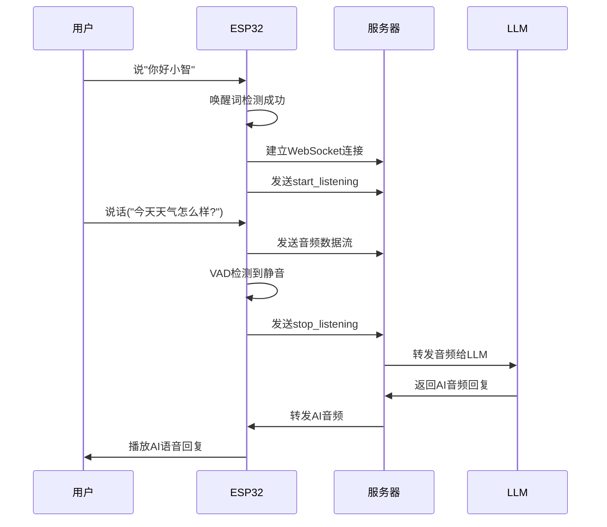

# ESP32-S3 智能语音助手 - LLM集成示例

这是一个ESP32-S3与大语言模型(LLM)集成的语音助手示例，通过WebSocket连接Python服务器，实现实时语音对话功能。

## 🌟 本示例代码主要做了什么？

这个项目实现了ESP32与大语言模型的实时语音对话，当你说"你好小智"唤醒设备后，可以与AI进行自然语言对话。系统会将你的语音发送到服务器，经过LLM处理后返回语音回复。

**为什么做这个？**  
展示如何将ESP32与现代大语言模型结合，实现真正的智能语音助手。不再局限于固定命令词，而是可以进行开放式的自然语言对话。

## ⚡ 功能特性

- ✅ **语音唤醒检测** - 支持"你好小智"唤醒词或BOOT按键手动唤醒
- ✅ **实时语音对话** - 与Qwen Omni Turbo Realtime模型进行语音对话
- ✅ **VAD语音活动检测** - 自动检测用户说话结束(2秒静音超时)
- ✅ **WebSocket通信** - 与Python服务器实时通信
- ✅ **音频流传输** - 实时上传音频并接收AI语音回复
- ✅ **WiFi网络连接** - 自动连接配置的WiFi网络

## 📦 需要准备什么？

### 硬件清单（淘宝都能买到）

| 部件   | 推荐型号           | 备注                       |
| ------ | ------------------ | -------------------------- |
| 开发板 | ESP32-S3-DevKitC-1 | 必须是 S3 版本，需要 PSRAM |
| 麦克风 | INMP441            | 约 5 元/个                 |
| 功放   | MAX98357A          | 约 8 元/个                 |
| 喇叭   | 4Ω 3W 小喇叭       | 约 3 元/个                 |
| LED 灯 | 任意颜色           | 普通发光二极管即可         |

### 接线图（完全按照小智 AI 的接线方式）

```text
麦克风(INMP441) → ESP32开发板
-----------------------------
VDD（麦克风）→ 3.3V（开发板）  // 接电源正极
GND（麦克风）→ GND（开发板）   // 接电源负极
SD  （麦克风）→ GPIO6         // 数据线
WS  （麦克风）→ GPIO4         // 左右声道选择
SCK （麦克风）→ GPIO5         // 时钟线

功放(MAX98357A) → ESP32开发板
-----------------------------
VIN（功放）→ 3.3V（开发板）   // 接电源正极
GND（功放）→ GND（开发板）    // 接电源负极
DIN（功放）→ GPIO7           // 音频数据输入
BCLK（功放）→ GPIO15         // 位时钟
LRC（功放）→ GPIO16          // 左右声道时钟

LED控制
-------
LED长脚 → GPIO21        // 信号线
LED短脚 → GND           // 接地

喇叭连接
--------
喇叭正极 → 功放 +
喇叭负极 → 功放 -
```

> 💡 接线提示：严格按照上述接线，这是经过验证的小智 AI 标准接线方式

## 🚀 快速上手

### 前置要求

1. **ESP-IDF开发环境** - ESP-IDF v5.0+
2. **Python环境** - Python 3.8+
3. **阿里云API** - DashScope API Key

### 方法 1：使用ESP-IDF编译（推荐）

#### ESP32固件配置和编译

```bash
# 步骤1：修改WiFi和服务器配置
# 编辑 main/main.cc 文件，修改以下内容：
# - WIFI_SSID: 你的WiFi名称
# - WIFI_PASS: 你的WiFi密码  
# - WEBSOCKET_URI: Python服务器地址

# 步骤2：配置项目
idf.py menuconfig

# 在蓝色菜单中进行以下配置：
# ① ESP Speech Recognition → Load Multiple Wake Words
#    选择 "CONFIG_SR_WN_WN9_NIHAOXIAOZHI_TTS" (你好小智)
# ② ESP Speech Recognition → VAD模型
#    选择 "CONFIG_SR_VADN_VADNET5_QUANT8" (VADNet5)
# ③ 按S保存，按Q退出

# 步骤3：编译代码（约2-3分钟）
idf.py build

# 步骤4：连接开发板到电脑USB口
idf.py flash      # 自动烧录程序

# 步骤5：查看运行状态  
idf.py monitor    # 看到"WiFi连接成功"就可以了
```

#### Python服务器配置和启动

```bash
# 步骤1：进入服务器目录
cd server

# 步骤2：安装依赖
pip install -r requirements.txt

# 步骤3：设置API密钥
export DASHSCOPE_API_KEY=your_api_key_here

# 步骤4：启动服务器
python server.py
# 看到"服务器启动成功，等待客户端连接..."即可

# 步骤5：测试连接(可选)
# 新开一个终端窗口
python client.py
# 输入 "start" 测试语音对话功能
```

## 🎯 使用方法

### 语音对话流程

1. **启动系统**
   - 确保ESP32已连接到WiFi网络
   - 确保Python服务器正在运行
   - ESP32会自动连接到WebSocket服务器

2. **唤醒对话**
   - 对着麦克风说"你好小智"
   - 或者按下ESP32开发板上的BOOT按键
   - 听到欢迎音频后进入录音状态

3. **语音对话**
   - 开始说话，系统会实时录制音频
   - VAD会自动检测你说话结束(2秒静音)
   - 音频发送到LLM进行处理
   - 播放AI的语音回复

4. **循环对话**
   - AI回复播放完成后自动回到等待唤醒状态
   - 可以再次说"你好小智"或按BOOT键继续对话

### 系统状态指示

- **等待唤醒**：串口显示"等待唤醒词 '你好小智' 或按下BOOT按键"
- **录音中**：串口显示"🎤 开始录音，请说话..."
- **等待回复**：串口显示"🛑 录音结束，等待AI回复..."
- **播放回复**：串口显示"✓ AI音频回复播放成功"

### 对话示例

```
用户: "你好小智"
ESP32: [播放欢迎音] 🎤 开始录音

用户: "今天天气怎么样？"
ESP32: 🛑 录音结束，等待AI回复...
AI: [语音回复] "今天天气不错，阳光明媚，适合出门活动。"

用户: "你好小智"  
ESP32: [播放欢迎音] 🎤 开始录音

用户: "给我讲个笑话"
ESP32: 🛑 录音结束，等待AI回复...
AI: [语音回复] "为什么程序员喜欢黑暗？因为光明会产生bug！"
```

## ⚙️ 自定义配置

### 修改WiFi配置

编辑 `main/main.cc` 文件：

```cpp
// 第61-62行，修改WiFi配置
#define WIFI_SSID "your_wifi_ssid"      // 改成你的WiFi名称
#define WIFI_PASS "your_wifi_password"  // 改成你的WiFi密码
```

### 修改服务器地址

编辑 `main/main.cc` 文件：

```cpp
// 第66行，修改WebSocket服务器地址
#define WEBSOCKET_URI "ws://192.168.1.100:8888"  // 改成你的服务器IP
```

### 调整VAD静音超时时间

修改 `main/main.cc` 文件：

```cpp
// 第102行，调整VAD静音检测超时时间
#define VAD_SILENCE_TIMEOUT_MS 2000  // 改成你想要的毫秒数(建议1000-3000)
```

### 更换唤醒词

```bash
idf.py menuconfig
```

→ `ESP Speech Recognition` → `Load Multiple Wake Words`  
→ 选择你喜欢的唤醒词（如"小爱同学"、"嗨乐鑫"等）  
→ 按 S 保存，按 Q 退出，重新编译烧录

### 调整检测灵敏度

修改 `main/main.cc` 文件：

```cpp
// 第614行，调整唤醒词检测灵敏度
wn_model_data = wakenet->create(wn_name, DET_MODE_90);
//  DET_MODE_90 - 推荐值（平衡型）
//  DET_MODE_95 - 最严格（减少误触发）
//  DET_MODE_80 - 最宽松（提高检测率）
```

### 修改LLM指令

编辑 `server/omni_realtime_client.py` 文件：

```python
# 第159行，修改AI角色设定
"instructions": "你是一个友好的AI助手，可以回答各种问题并进行对话。请用简洁友好的方式回复。"
```

## ❓ 常见问题排除

### Q1：WiFi连接失败？

1. 检查 `main/main.cc` 中的 WIFI_SSID 和 WIFI_PASS 配置
2. 确认WiFi网络可用且信号强度足够
3. 检查WiFi密码是否正确
4. 确认开发板距离路由器不要太远

### Q2：WebSocket连接失败？

1. 确认Python服务器已经启动并监听8888端口
2. 检查服务器IP地址配置是否正确
3. 确认防火墙设置允许8888端口通信
4. 使用Python客户端测试服务器是否正常工作

### Q3：没有声音输出？

1. 检查 MAX98357A 接线是否正确
2. 确认喇叭连接到功放的+/-端子
3. 检查 3.3V 供电是否稳定
4. 查看串口日志中是否有音频播放错误信息

### Q4：语音识别不响应？

1. 确保在安静环境下测试
2. 距离麦克风 20-50 厘米清晰发音
3. 检查 INMP441 接线，特别是 SD 数据线
4. 降低检测灵敏度（DET_MODE_90→DET_MODE_80）

### Q5：LLM无回复？

1. 检查 DASHSCOPE_API_KEY 环境变量是否设置正确
2. 确认API密钥有效且有足够余额
3. 检查网络连接是否稳定
4. 查看服务器日志中的错误信息

### Q6：VAD检测不准确？

1. 调整 VAD_SILENCE_TIMEOUT_MS 参数(1000-3000ms)
2. 确保麦克风音频质量良好
3. 尝试在更安静的环境下测试
4. 如果VAD功能异常，可以使用BOOT按键手动控制录音

## 📚 技术原理（进阶学习）

### 使用的 AI 模型

- **WakeNet9**：第 9 代唤醒词检测模型，支持"你好小智"等多种唤醒词
- **VADNet5**：第 5 代语音活动检测模型，用于检测用户说话开始和结束
- **Qwen Omni Turbo Realtime**：阿里云实时语音对话大模型

### 音频处理流程

1. **音频采集**：INMP441 以 16kHz 采样率采集音频
2. **唤醒检测**：WakeNet9 实时检测唤醒词
3. **VAD检测**：VADNet5 检测语音活动，判断用户说话结束
4. **音频编码**：Base64 编码音频数据进行网络传输
5. **LLM处理**：Qwen模型进行语音理解和生成
6. **音频播放**：播放LLM返回的24kHz音频回复

### 通信协议

- **WebSocket**：实时双向通信协议
- **JSON格式**：结构化消息格式
- **Base64编码**：音频数据编码方式
- **PCM格式**：原始音频数据格式

### 内存管理策略

- **PSRAM 存储**：语音模型加载到外部 PSRAM
- **内部 RAM**：音频缓冲区使用内部 RAM 确保实时性
- **动态分配**：根据模型需求动态分配内存
- **连接管理**：WebSocket连接自动重连机制

## 🎁 项目结构

```text
examples/use_llm/
├── main/                    # ESP32固件源码
│   ├── main.cc             # 主程序（WebSocket客户端+语音处理）
│   ├── bsp_board.cc/.h     # 硬件抽象层（麦克风/功放控制）
│   ├── mock_voices/        # 预录制音频文件
│   │   └── welcome.h       # 欢迎音频
│   └── CMakeLists.txt      # 组件构建配置
├── server/                 # Python WebSocket服务器
│   ├── server.py           # WebSocket服务器主程序
│   ├── client.py           # Python测试客户端
│   ├── omni_realtime_client.py  # LLM客户端封装
│   ├── requirements.txt    # Python依赖包
│   └── README.md          # 服务器使用说明
├── model_demo/            # 原始LLM示例代码（参考用）
│   ├── main.py            # 直连LLM示例
│   └── omni_realtime_client.py
├── CMakeLists.txt         # 项目构建配置
├── sdkconfig.defaults     # ESP-IDF默认配置
└── README.md             # 本文件
```

## 🔄 工作流程图



## 📜 开源协议

Apache 2.0 - 可自由用于个人/商业项目，注明原作者即可

## 💡 扩展功能建议

基于此项目可以扩展的功能：

- **多轮对话**: 支持上下文记忆的连续对话
- **情感识别**: 识别用户情感并调整回复语调  
- **多语言支持**: 支持英语、日语等多种语言对话
- **设备控制**: 集成智能家居设备控制
- **离线模式**: 集成本地小模型实现离线功能
- **语音克隆**: 自定义AI语音音色
- **群聊模式**: 支持多用户同时对话

## 📞 技术支持

- **项目地址**: [GitHub仓库](https://github.com/your-repo/xiaozhi-replica)
- **问题反馈**: 提交 Issue 或 Pull Request
- **技术交流**: 欢迎 Star ⭐ 和 Fork 🍴

**觉得项目有帮助？给个 Star✨ 就是最大的鼓励！**
